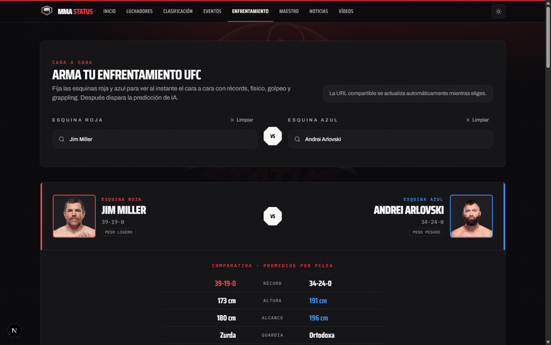
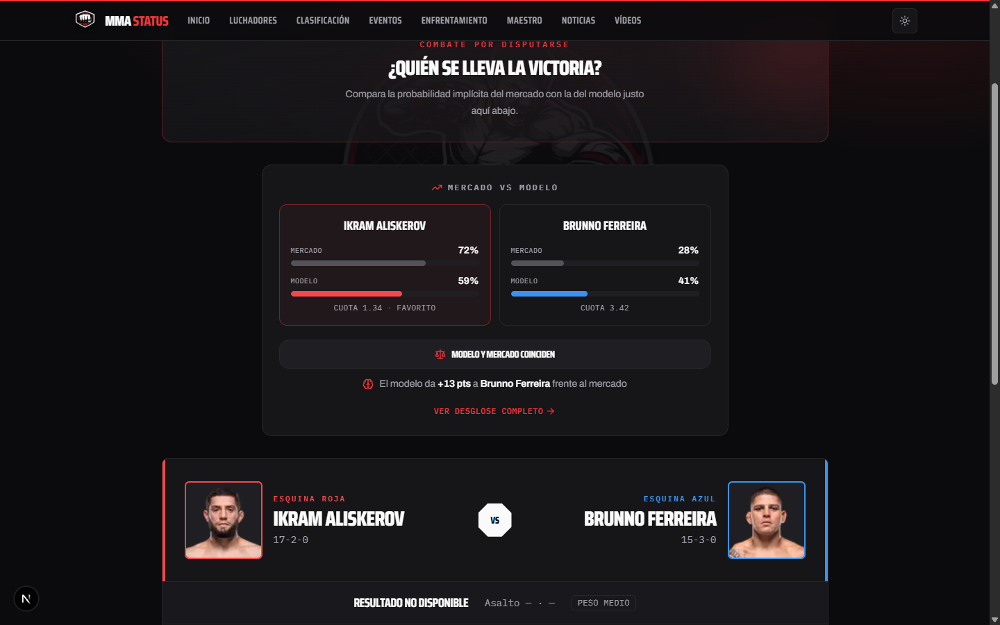
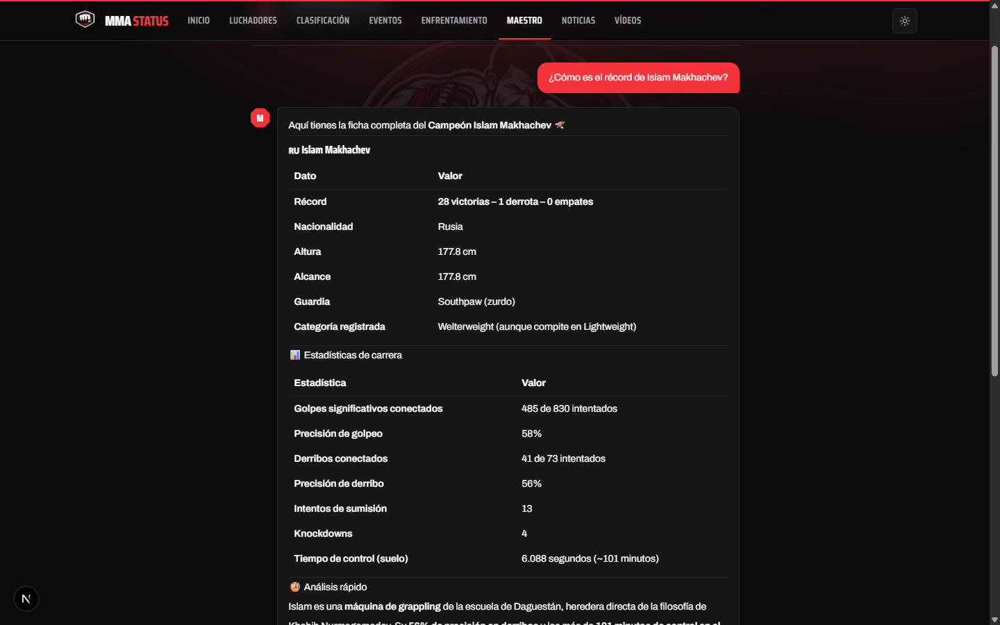

<div align="center">


### Una web de estadísticas de UFC con un modelo de ML que predice peleas

Fichas de luchadores, clasificación oficial, comparativas cara a cara, las cuotas del mercado frente al modelo, un asistente con IA y vídeos de combates, todo sobre datos reales.

[](https://mma-app-ruby.vercel.app)


[](https://github.com/chocitagaming-art/mma-app/actions/workflows/ci.yml)


[](https://github.com/chocitagaming-art/mma-app/stargazers)


[English](./README.md) · Español

</div>


### Contenido

- [Qué es](#qué-es)
- [Míralo en acción](#míralo-en-acción)
- [Funciones](#funciones)
- [Cómo funciona la predicción](#cómo-funciona-la-predicción)
- [Stack](#stack)
- [Arquitectura](#arquitectura)
- [Ejecutar en local](#ejecutar-en-local)
- [Licencia](#licencia)

## Qué es

MMA STATUS es la mitad web de un proyecto de dos repos. Este repo es el sitio que ves: una app de Next.js que lee datos de UFC y los sirve como fichas de luchador, clasificación, un comparador cara a cara y un predictor de peleas. El otro repo, [mma-ingesta](https://github.com/chocitagaming-art/mma-ingesta), hace el scraping, el machine learning y levanta el servicio de predicción. Los dos comparten una base de datos PostgreSQL en Neon, y la web solo lee de ella.

Los datos son reales. Luchadores, peleas, estadísticas, rankings y eventos salen de scrapear UFC y ESPN. Las cuotas vienen de The Odds API (solo eventos próximos). Los vídeos, de YouTube. La predicción la da un modelo XGBoost entrenado con estadísticas de los peleadores, y las explicaciones las escribe Claude.

## Míralo en acción

Eliges esquina roja y azul, las comparas de arriba abajo y dejas que el modelo decida la pelea.



## Funciones

Fichas de luchador con récord, racha actual, forma en las últimas cinco, precisión de golpeo y de derribo, victorias por método, y una silueta que muestra dónde conecta un peleador y dónde recibe, por zona (cabeza, cuerpo, pierna) y posición (distancia, clinch, suelo).


Predicción para cualquier enfrentamiento. Eliges esquina roja y azul, pulsas predecir, y el modelo devuelve una probabilidad para cada uno, las señales por esquina que hay detrás (racha, victorias recientes, calidad del rival, defensa), los factores que más inclinan la decisión y una explicación corta en español.


Mercado vs modelo en peleas próximas. La probabilidad implícita de las cuotas, ya sin el margen de la casa, al lado de lo que cree el modelo, con la ventaja marcada en puntos. Poner las dos cosas lado a lado es poco habitual en proyectos parecidos.



El Maestro, un asistente de chat que responde con datos de la base de datos real. Le pides un récord o unas estadísticas y consulta los datos y enseña de dónde los saca, en lugar de inventar de memoria.



Clasificación oficial por división y libra por libra, masculina y femenina, con el movimiento desde el último snapshot.


Un comparador cara a cara te deja elegir dos luchadores y comparar la tabla comparativa, las dos siluetas de golpes y el historial directo. La URL se comparte, así que un enfrentamiento es un enlace. Cada ficha también recoge la trayectoria de ranking con el tiempo, y la web incluye un feed de vídeos de combates curados y noticias de MMA.

## Cómo funciona la predicción

- El modelo se entrena solo con estadísticas de los peleadores: 20 features que cubren récords, físico, golpeo, grappling, forma y calidad del rival. Las cuotas nunca entran. Cuando ves las cuotas al lado del modelo, es una comparación, no una variable.
- La precisión ronda el 63% (0.6289, calibrado y simetrizado), con un Brier de 0.2266, entrenado sobre unos 2.838 luchadores y 8.750 peleas. Son estimaciones con incertidumbre real, no certezas: en MMA hasta un favorito claro acaba KO.
- Si uno de los dos tiene poco historial, como un debutante, el modelo lo dice y se queda cerca del 50/50 en lugar de inventarse confianza.
- Un microservicio FastAPI del repo de datos sirve el modelo, y las predicciones funcionan en vivo en la web.

## Stack

- **Web (este repo):** Next.js 16 (App Router), React 19, TypeScript, Tailwind CSS, `pg`. Desplegado en Vercel.
- **Datos y ML:** Python, PostgreSQL en Neon, XGBoost, FastAPI. Scrapers de UFC y ESPN, cuotas de The Odds API, vídeos de la YouTube Data API.
- **IA:** Anthropic Claude para las explicaciones de los enfrentamientos y el asistente Maestro.

## Arquitectura

```
            ┌──────────────────────────┐        ┌──────────────────────────┐
Navegador ─▶│  mma-app (Next.js)        │── SQL ▶│  PostgreSQL (Neon)        │
            │  Vercel · solo lectura    │        │  fuente de verdad         │
            └──────────┬───────────────┘        └──────────▲───────────────┘
                       │  /api/predict                       │ escrituras
                       ▼                                     │
            ┌──────────────────────────┐        ┌───────────┴──────────────┐
            │  Servicio de predicción   │── SQL ▶│  mma-ingesta (Python)     │
            │  FastAPI · XGBoost        │        │  scrapers + pipeline ML    │
            └──────────────────────────┘        │  + The Odds API + YouTube  │
                       │  explicaciones          └──────────────────────────┘
                       ▼
            ┌──────────────────────────┐
            │  Anthropic Claude         │
            └──────────────────────────┘
```

La web solo lee de la base de datos, mientras que el repo de Python escribe en ella.

## Ejecutar en local

Necesitas Node 20+ y un `DATABASE_URL` que apunte a un Postgres con el esquema del proyecto.

```bash
npm install
npm run dev -- -p 3100   # http://localhost:3100  (el 3000 suele estar ocupado)
```

Pon tus secretos en `.env.local`. Los nombres de las variables están en [`.env.example`](./.env.example):

- `DATABASE_URL` (obligatoria)
- `ANTHROPIC_API_KEY` (para el Maestro y las explicaciones)
- `PREDICTION_SERVICE_URL` (el servicio FastAPI)
- `YOUTUBE_API_KEY` (para los vídeos)

Para ejecutar predicciones mientras desarrollas en local, levanta el servicio del repo de datos:

```bash
# en el repo mma-ingesta
python -m uvicorn src.prediction.service:app --port 8000
```

Luego apunta `PREDICTION_SERVICE_URL` a `http://localhost:8000`.

## Comandos

```bash
npm run dev       # servidor de desarrollo
npm run build     # build de producción
npm test          # vitest
npm run lint      # eslint
npx tsc --noEmit  # comprobación de tipos
```

## Estructura

```
src/
  app/          # rutas: inicio, luchadores, clasificación, eventos, enfrentamiento, maestro, noticias, vídeos, api
  components/   # UI, incluido matchup/ (el comparador cara a cara) y las piezas de fighter/
  lib/          # queries (partidas por dominio), db, formato, cliente de predicción, tools del maestro
```

El acceso a datos vive en `src/lib/queries`, partido en módulos pequeños por dominio (list, detail, mappers, types) detrás de una ruta de import estable.

## Tests

La suite de Vitest cubre la lógica pura: comparación mercado vs modelo, cálculo de forma, formato, parseo de YouTube. La comprobación de tipos y el build de producción salen limpios. El repo de datos y ML lleva su propia suite de pytest, incluidos los golden y de paridad que fijan las features del modelo.

## El otro repo

[**mma-ingesta**](https://github.com/chocitagaming-art/mma-ingesta) tiene los scrapers, el pipeline de features, el entrenamiento del modelo y el servicio FastAPI de predicción. Si quieres saber de dónde salen los datos y las predicciones, empieza por ahí.

Hay también un manual de producto más completo: [MANUAL.md](./MANUAL.md).

## Licencia

MIT © 2026 MMA STATUS. Ver [LICENSE](./LICENSE). Proyecto personal de MMA STATUS; los issues y pull requests son bienvenidos.
