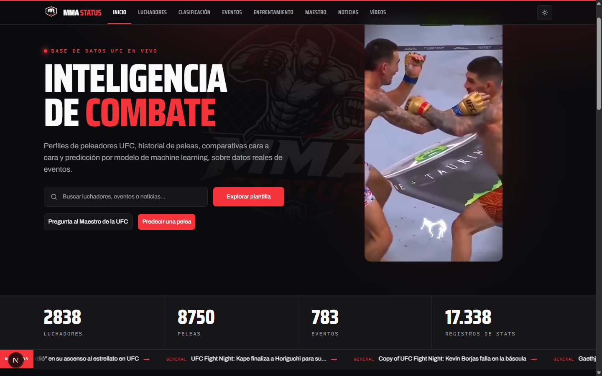
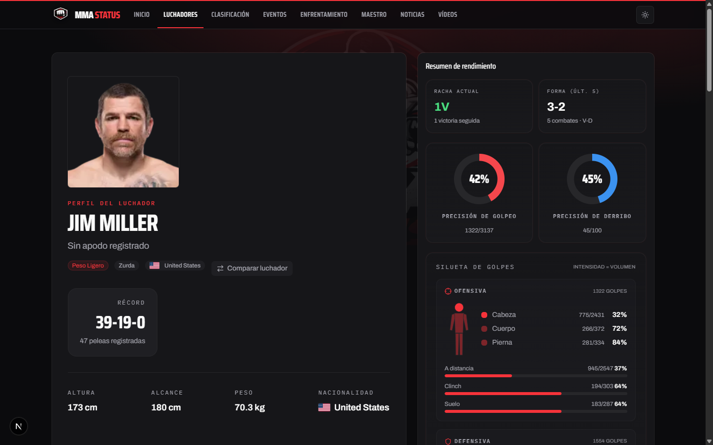
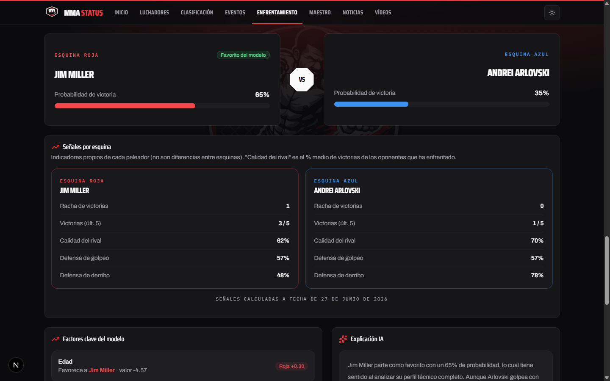
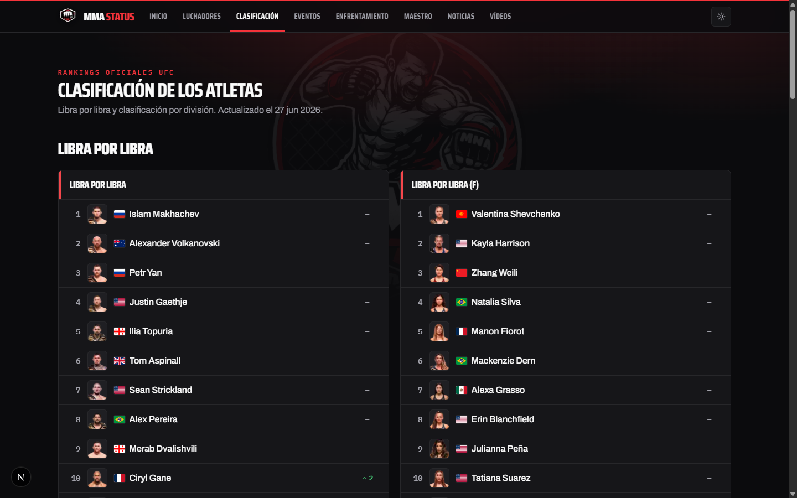

# MMA STATUS

A live UFC stats site with a machine learning model that predicts fights. Fighter profiles, official rankings, head to head comparisons, market odds against the model, an AI assistant, and fight videos, all built on real scraped data.

[](https://mma-app-ruby.vercel.app)


**Live site: [mma-app-ruby.vercel.app](https://mma-app-ruby.vercel.app)**

Read this in: **English** · [Español](./README.es.md)



## What it is

MMA STATUS is the web half of a two repo project. This repo is the site you see: a Next.js app that reads UFC data and serves it as fighter pages, rankings, a head to head builder, and a fight predictor. The other repo, [mma-ingesta](https://github.com/chocitagaming-art/mma-ingesta), does the scraping, the machine learning, and runs the prediction service. Both share one PostgreSQL database on Neon, and the web app only ever reads from it.

The data is real. Fighters, fights, stats, rankings, and events come from scraping UFC and ESPN. Odds come from The Odds API (upcoming fights only). Videos come from YouTube. The fight prediction comes from an XGBoost model trained on fighter stats, and the explanations are written by Claude.

## A look around

**Fighter profile** with record, current streak, last five form, striking and takedown accuracy, and a strike map showing where a fighter lands and where they get hit, broken down by zone and range.



**Prediction** for any matchup. Pick a red and blue corner, hit predict, and the model returns a probability for each fighter, the per corner signals behind it (streak, recent wins, quality of opposition, defense), the factors that moved the call, and a short explanation in plain Spanish.



**Official rankings** by division and pound for pound, men and women, with the movement since the last snapshot.



## Features

- Fighter profiles: career record, current streak and last five form, striking and takedown accuracy, win methods, and a strike map by zone (head, body, leg) and range (distance, clinch, ground).
- A head to head builder. Choose two fighters and compare the tale of the tape, both strike maps, and any shared history. The URL is shareable, so a matchup is a link.
- Fight prediction from a model trained only on stats. It never sees odds. Each prediction comes with per corner signals and a written explanation.
- Market vs model on upcoming fights: the implied probability from the odds, with the bookmaker margin removed, next to what the model thinks, and where it sees value.
- Ranking trajectory on each profile, so you can watch a fighter climb or slide over time.
- "El Maestro", a chat assistant that answers from the real database (records, stats, rankings, events) instead of guessing.
- Curated fight videos and MMA news.

## How the prediction works

A few things worth being honest about, because most fight predictors are not:

- The model is trained **only on fighter stats**: records, physical attributes, striking, grappling, form, quality of opposition. Odds are never an input. When you see odds next to the model, that is a comparison, not a feature.
- Accuracy sits around **63%** (0.6289, calibrated and symmetrized). That is an estimate with real uncertainty, not a lock. In MMA a clear favorite still gets knocked out.
- If either fighter is thin on history, like a debutant, the model says so and sits near 50/50 instead of inventing confidence.
- The model is served by a small FastAPI service that lives in the other repo. It runs locally during development. In production the app degrades quietly when the service is offline, showing the market side and a retry button instead of a red error.

## Tech stack

- **Web (this repo):** Next.js 16 (App Router), React 19, TypeScript, Tailwind CSS, `pg`. Deployed on Vercel.
- **Data and ML ([mma-ingesta](https://github.com/chocitagaming-art/mma-ingesta)):** Python, PostgreSQL on Neon, XGBoost, FastAPI. Scrapers for UFC and ESPN, odds from The Odds API, videos from the YouTube Data API.
- **AI:** Anthropic Claude for the matchup explanations and the Maestro assistant.

## Architecture

```
            ┌──────────────────────────┐        ┌──────────────────────────┐
 Browser ──▶│  mma-app (Next.js)        │── SQL ▶│  PostgreSQL (Neon)        │
            │  Vercel · read only       │        │  single source of truth   │
            └──────────┬───────────────┘        └──────────▲───────────────┘
                       │  /api/predict                       │ writes
                       ▼                                     │
            ┌──────────────────────────┐        ┌───────────┴──────────────┐
            │  Prediction service       │── SQL ▶│  mma-ingesta (Python)     │
            │  FastAPI · XGBoost        │        │  scrapers + ML pipeline    │
            └──────────────────────────┘        │  + The Odds API + YouTube  │
                       │  explanations           └──────────────────────────┘
                       ▼
            ┌──────────────────────────┐
            │  Anthropic Claude         │
            └──────────────────────────┘
```

The web app reads. The Python repo writes. They meet at the database.

## Run it locally

You need Node 20+ and a `DATABASE_URL` pointing at a Postgres with the project schema.

```bash
npm install
npm run dev -- -p 3100   # http://localhost:3100  (3000 is often taken)
```

Put your secrets in `.env.local`. The variable names are in [`.env.example`](./.env.example):

- `DATABASE_URL` (required)
- `ANTHROPIC_API_KEY` (for the Maestro and matchup explanations)
- `PREDICTION_SERVICE_URL` (the FastAPI service, for live predictions)
- `YOUTUBE_API_KEY` (for videos)

To get live predictions you also need the service from the other repo running:

```bash
# in the mma-ingesta repo
python -m uvicorn src.prediction.service:app --port 8000
```

Then point `PREDICTION_SERVICE_URL` at `http://localhost:8000`. Without it, the app still runs and shows the graceful fallback.

## Commands

```bash
npm run dev       # dev server
npm run build     # production build
npm test          # vitest (138 tests)
npm run lint      # eslint
npx tsc --noEmit  # type check
```

## Project layout

```
src/
  app/          # routes: home, fighters, rankings, events, matchup, maestro, news, videos, api
  components/   # UI, including matchup/ (the head to head builder) and fighter/ pieces
  lib/          # queries (split by domain), db, formatting, prediction client, maestro tools
```

The data access lives in `src/lib/queries`, split into small modules by domain (list, detail, mappers, types) behind a stable import path.

## Tests

138 Vitest tests cover the pure logic: market vs model comparison, form computation, formatting, YouTube parsing. Type checking and a production build run clean. The data and ML repo carries another 113 pytest tests, including golden and parity tests that pin the model features.

## The other repo

[**mma-ingesta**](https://github.com/chocitagaming-art/mma-ingesta) holds the scrapers, the feature pipeline, the model training, and the FastAPI prediction service. If you want to know where the data and the predictions come from, start there.

There is also a fuller product manual in Spanish: [MANUAL.md](./MANUAL.md).

## License

MIT.
