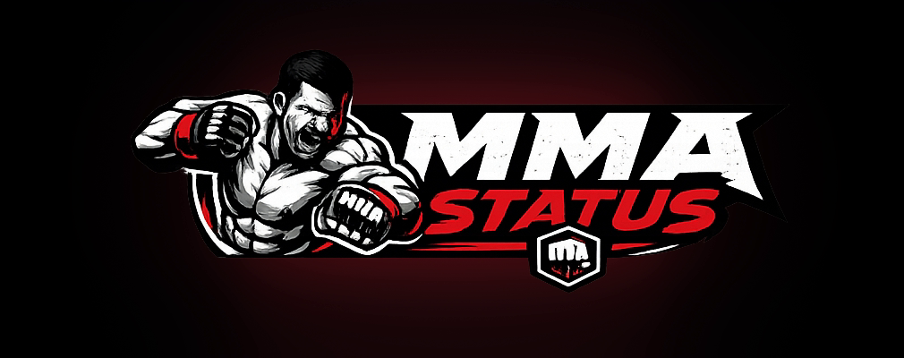
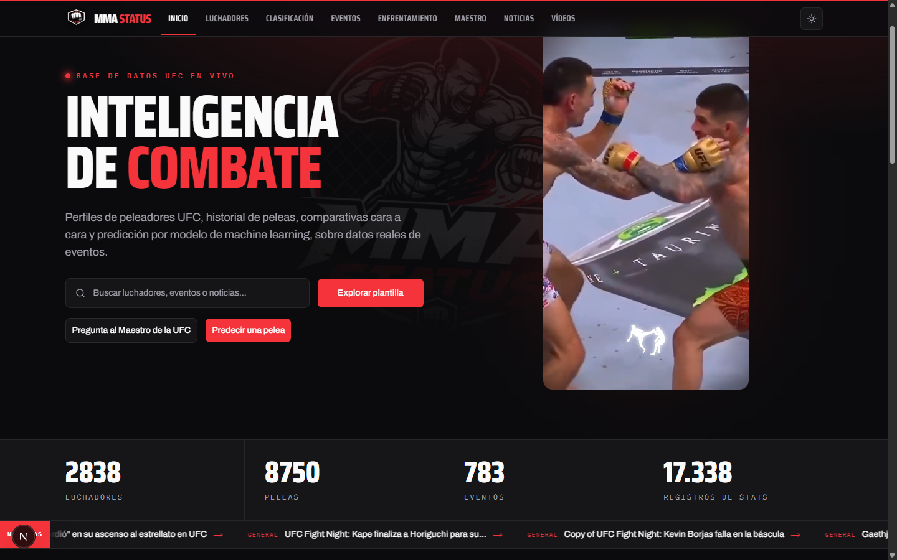
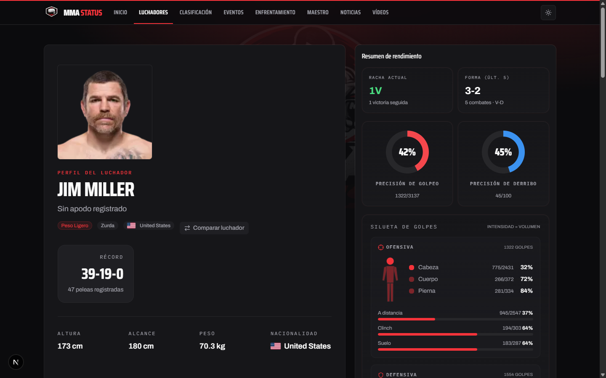
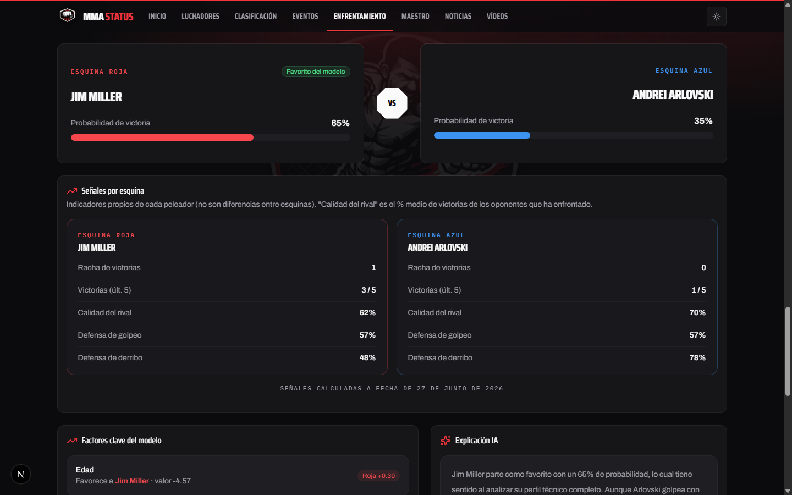
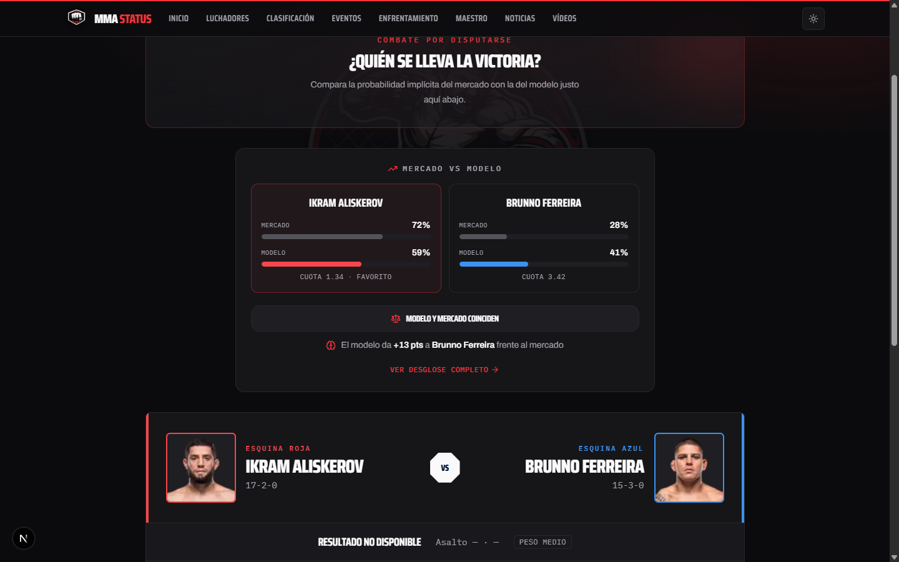
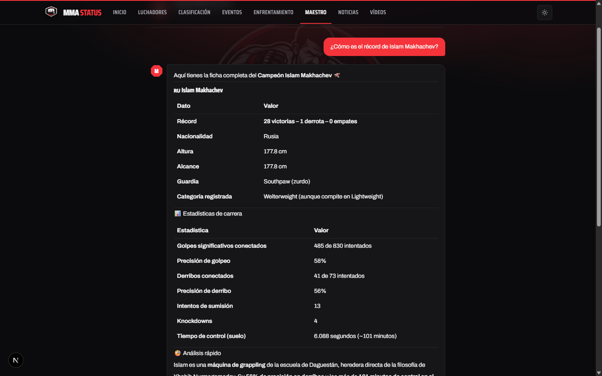
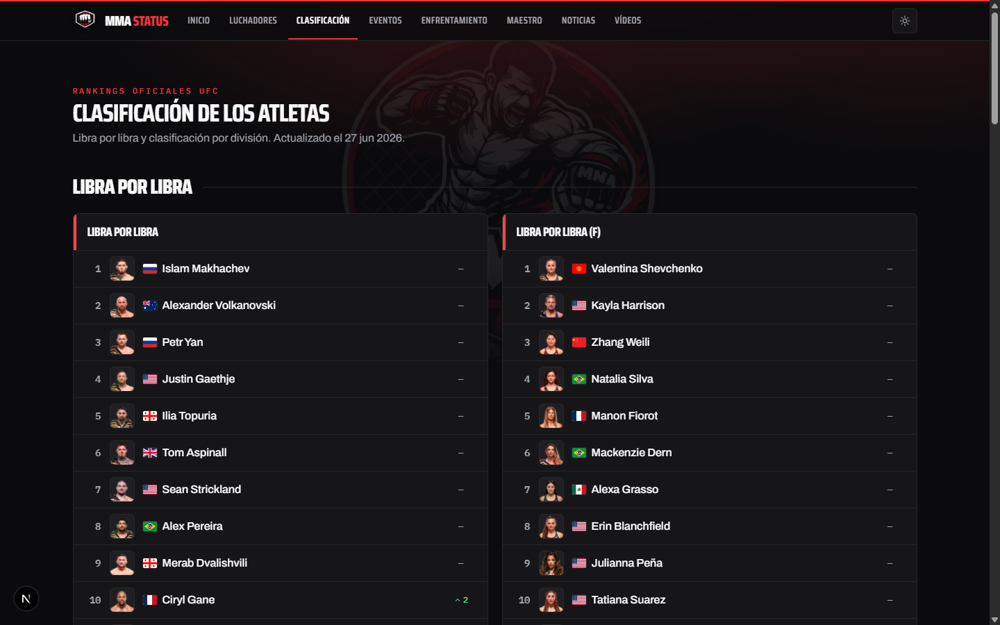
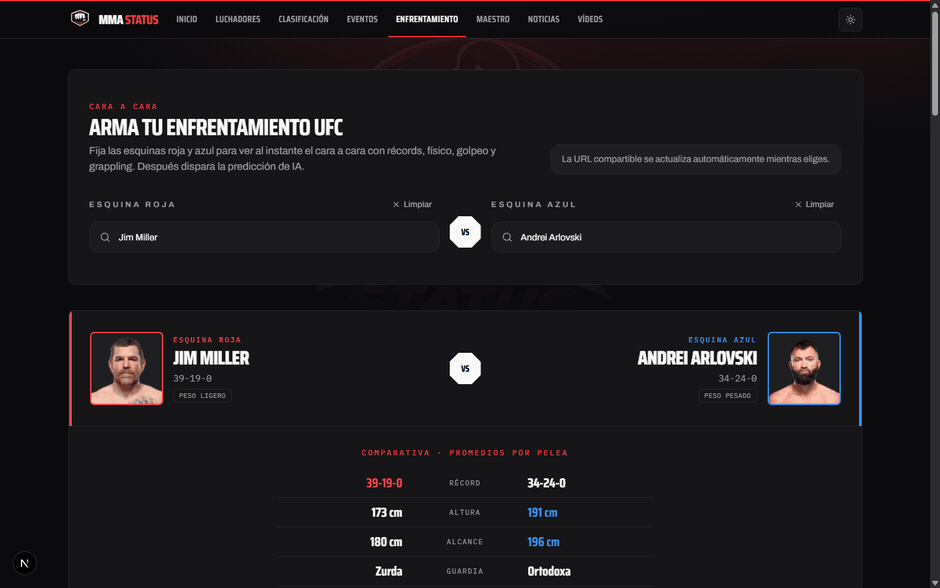

### A UFC stats site with a model that predicts fights

Fighter profiles, official rankings, head-to-head comparisons, market odds against the model, an AI assistant and fight videos — all on real data.

English · [Español](./README.es.md)

## What this is

**[MMA STATUS](https://mmastatus.app)** is a Spanish-language UFC statistics
site, built on real data, with a model that estimates who wins a matchup.

This repository is the website. The other one,
[mma-ingesta](https://github.com/chocitagaming-art/mma-ingesta), collects the
data and trains the model.

## What you can do with it

**Fighter profiles** with record, current streak, form over the last five,
striking and takedown accuracy, wins by method, and a silhouette showing where a
fighter lands and where they get hit, by target and position.

**Predict any matchup.** Pick a red and a blue corner, and the model returns a
probability for each, the signals behind it and a short explanation.

**Market vs model** on upcoming fights: what the odds imply, with the
bookmaker's margin removed, next to what the model thinks, with the gap marked.
Showing both side by side is unusual, and it is what makes the comparison
honest.

**El Maestro**, an assistant that answers from the real database and shows where
the numbers came from, instead of recalling them from memory.

**Official rankings** by division and pound-for-pound, men's and women's, with
movement since the last snapshot.

**Head-to-head comparison** with a tale of the tape, striking silhouettes and
the direct history. The URL is shareable, so a matchup is a link.

Plus: ranking trajectory over time, live event coverage with results as they
happen, a news and video feed, offline support and installable as a mobile app.

## How it's built

Next.js 16 with the App Router, React 19, TypeScript and Tailwind CSS, deployed
on Vercel. It reads from a PostgreSQL database and calls a microservice for
predictions. Explanations are written by a language model.

The web app **only reads**: it never writes to the database.

## Quality

- Type checking, linting and unit tests on every push.
- **123 end-to-end tests** against real routes, across three screen sizes and
  both light and dark themes.
- A single command runs the six quality gates across both repositories, and no
  change is considered done until all of them are green.

## License

The code is **source-visible, not open source**: you may read and study it, but
not deploy it or use it commercially without permission. See
[LICENSE](./LICENSE).

The data shown on the site comes from third-party sources and is not owned by
this project.
